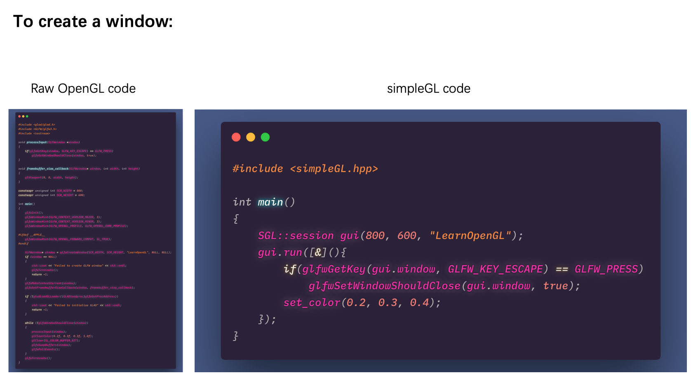
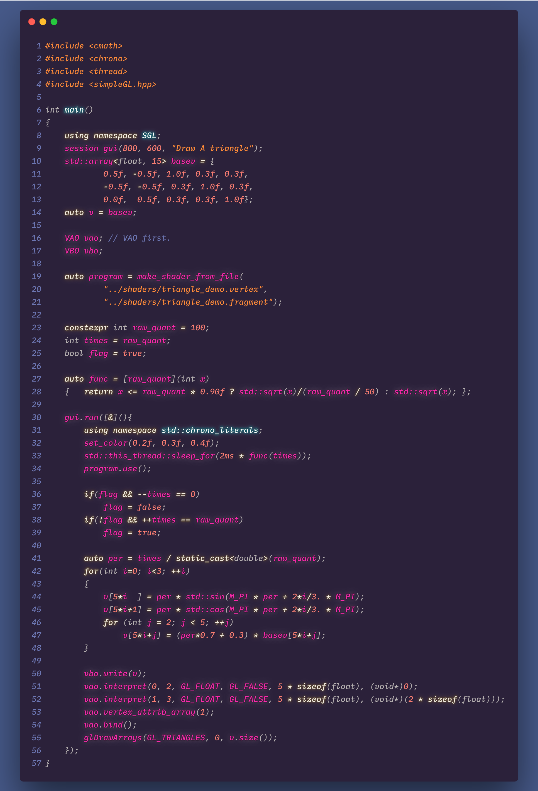
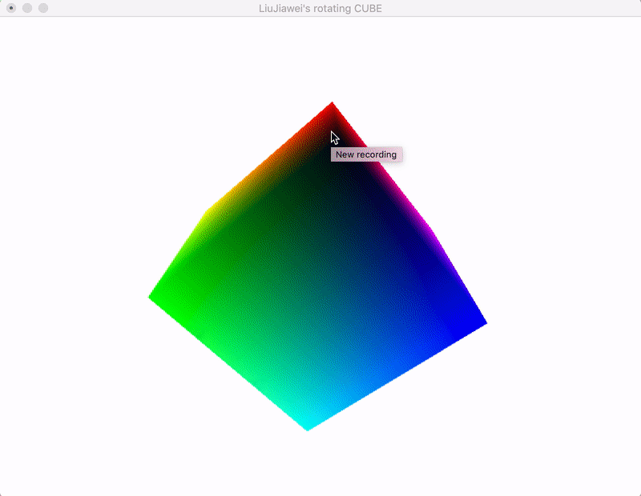
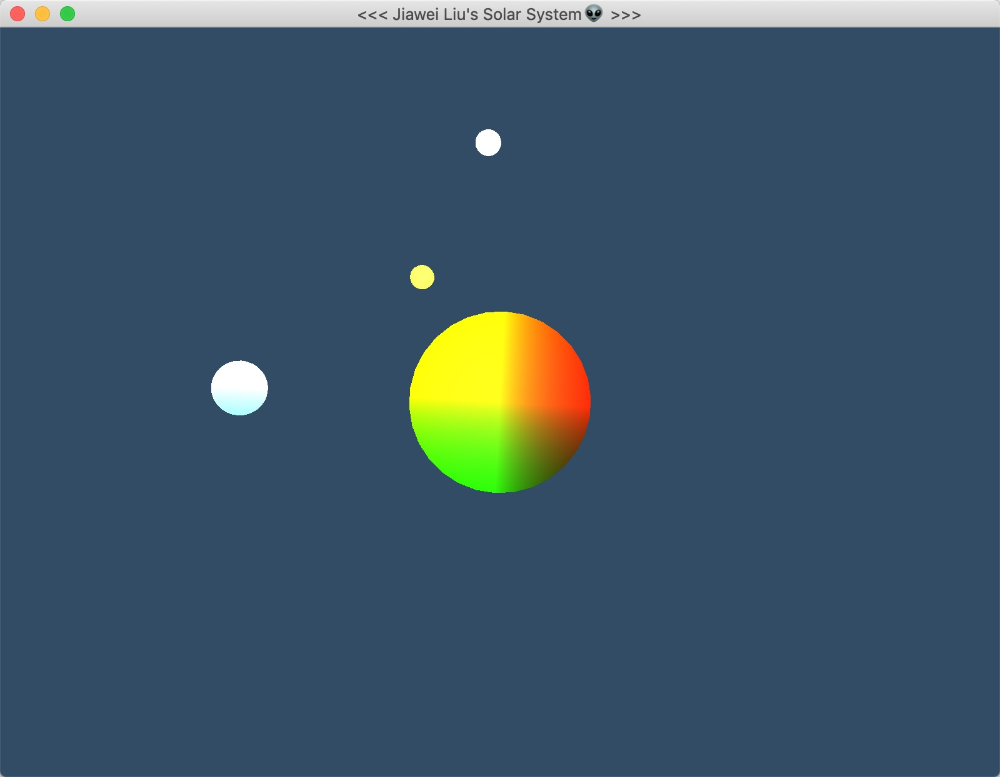

# SimpleGL: Simple C++ Wrapper for OpenGL

> We're:
> - Header-only.
> - Using modern OpenGL(#version > 3.2).
> - Both GLAD & GLEW are supported.

## Examples

### Window Creation

### Magic Triangle

> - Rotation
> - Size adjustment
> - Lightness changing

You only need almost 60 lines of code. And most of them is about math stuff.

### Magic cube

135 lines.

### Solar System

111 lines.